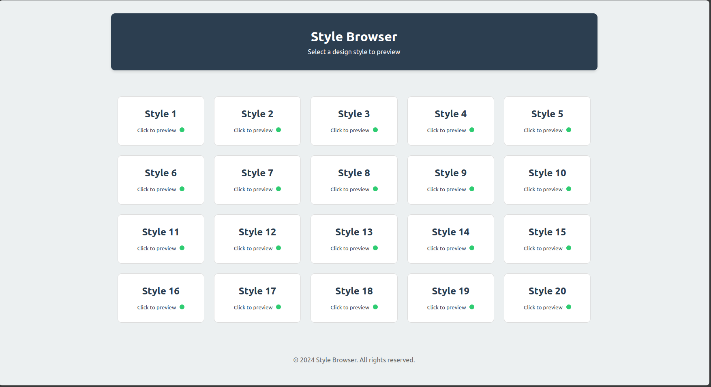

# Style Browser Project

A multi-style web interface for airline reservation systems featuring **20 unique design variations**.

---

## Overview

The Style Browser Project offers a dynamic, interactive experience for exploring different design styles for airline reservation systems. With a focus on responsiveness and accessibility, this project delivers a modern and user-friendly interface that works seamlessly across all devices.

---

## Key Features

- **20 Unique Design Styles:** Explore a diverse range of layouts and aesthetics.
- **Fully Responsive Layouts:** Mobile-first design ensures optimal viewing on any device.
- **Interactive Style Preview:** Clickable style cards allow instant preview of each design.
- **Standard Legal Pages:** Includes Terms & Conditions and Privacy Policy for compliance.
- **Availability Indicators:** Visual status with green (available) and red (WIP) dots.
- **Accessibility:** Keyboard-navigable interface enhances usability for all users.

---

## How to Use

1. **Open the Project:** Launch the application by opening `index.html` in your web browser.
2. **Explore Designs:** Click on any style card to view the corresponding design preview.
3. **Navigate with Ease:** Use the arrow keys on your keyboard for smooth navigation.
4. **Status Indicators:** 
   - **Green Dot:** The design style is available.
   - **Red Dot:** The design style is a work in progress (WIP).

---

## Project Structure

### Components

- **Main Page:**  
  - Hero section with an engaging introduction.
  - Wait timer for loading states.
  - Interactive airline list for quick access.

- **Legal Pages:**  
  - **Terms & Conditions:** Outlines the usage policies.
  - **Privacy Policy:** Details on data handling and user privacy.

- **Resources:**  
  - **CSS:** Leveraging Tailwind CSS alongside custom styles.
  - **Images:** Includes logos, backgrounds, and engaging GIFs.
  - **JavaScript:** Powers interactive popups and animations.

### Additional Features

- **Responsive Design:** Mobile-first approach for devices starting at 320px.
- **Sticky Footer:** A persistent call-to-action that stays visible during scrolling.
- **Animated Elements:** Dynamic pricing buttons enhance user interaction.
- **Service Grid:** A well-organized layout showcasing airline services.
- **Emergency Contact Overlay:** Quick access to urgent support information.

---

## Technical Specifications

- **Markup:** HTML5 Semantic Structure for improved accessibility and SEO.
- **Styling:** CSS3 with advanced animations, Flexbox, and Grid layouts.
- **Framework:** Tailwind CSS for rapid UI development and customization.
- **Performance:** Optimized for mobile devices and cross-browser compatibility.
- **JavaScript:** Enhancements for interactivity and smooth user experiences.

---

## Live Preview

Experience the designs in action by visiting the [live preview](https://jamal-aldeen.github.io/Airline-Reservations/).

---
